# Airline Customer Loyalty Data Analysis

## Project Summary

This project aims to analyze customer activity and demographic data from an airline loyalty program. Using Apache Spark, we performed a series of processes ranging from data cleaning, transformation, analysis, to visualization to gain valuable business insights.

The main goal is to understand customer behavior, identify key segments, and discover patterns that can be used to improve business and marketing strategies.

---

## Analysis Process Flow (Pipeline)

This data pipeline is designed modularly and executed sequentially by `main.py`. The main stages are as follows:

1.  **Initialization (`SparkManager`)**: Creates and configures a Spark session that forms the foundation of the entire process.
2.  **Data Loading (`DataLoader`)**: Loads raw datasets (`.csv`) from the `data/raw/` directory.
3.  **Data Cleaning (`DataCleaner`)**: Runs a series of cleaning processes on each dataset, including:
    * Standardizing column names.
    * Handling duplicate values.
    * Checking for and imputing null values using statistical methods (mean, median, or mode).
4.  **Clean Data Storage (`DataSaver`)**: Stores the results from the cleaning stage in Parquet format in the `data/cleaned/` directory as a checkpoint.
5.  **Data Transformation (`DataTransformer`)**: Joins flight activity data with customer demographic data based on `Loyalty_Number` to create a comprehensive dataset.
6.  **Data Analysis (`CustomerDataAnalyzer`)**: Executes a series of SQL queries on the merged data to answer key business questions. The results of each analysis are then saved in `.csv` format in the `data/analysis_results_csv/` directory.
7.  **Data Visualization (`DataVisualizer`)**: Converts analysis results into graphical visualizations (bar charts, line charts, scatter plots, etc.) and saves them as image files (`.png`) in the `final_visualizations/` directory.

---

## Analysis Details, Queries, and Interpretation

Below are the details of **all 14 analyses** performed, along with the SQL queries used, visualization results, and interpretation of potential insights found.

### 1. Average Flights per Customer per Year
* **Question:** What is the average number of flights for each customer per year?
* **SQL Query:**
    ```sql
    SELECT
        Loyalty_Number,
        Year,
        AVG(Total_Flights) as Avg_Flights_Per_Year
    FROM flight_activity_view
    GROUP BY Loyalty_Number, Year
    ORDER BY Loyalty_Number, Year
    ```
* **Insight Interpretation:**
    1.  Largest Contributor: Customers with a Bachelor's degree collectively contribute the most to the total flight distance.

    2.  Main Reason: This high number is likely not because each individual in this segment flies further, but because the number of customers in the "Bachelor" segment is the largest in the dataset. This graph shows the total (cumulative) value, not the average per customer.

    3.  High-Value Segments (Potential): The low total distance from "Master" and "Doctor" segments is likely due to their smaller population numbers. It's possible that if averaged, these segments would have the highest travel value per individual.

* **Conclusion:**
    By volume, the "Bachelor" customer segment is the most important mass market as they generate the largest total mileage. However, for more specific strategies such as premium offers or tiered loyalty programs, relying on this total data could be misleading.

### 2. Points Distribution by Loyalty Card
* **Question:** How is the total points accumulated by customers distributed based on their loyalty card type?
* **SQL Query:**
    ```sql
    SELECT
        Loyalty_Card,
        SUM(Points_Accumulated) as Total_Points_Accumulated,
        AVG(Points_Accumulated) as Avg_Points_Accumulated_Per_Record
    FROM merged_view
    WHERE Loyalty_Card IS NOT NULL
    GROUP BY Loyalty_Card
    ORDER BY Total_Points_Accumulated DESC
    ```
* **Graph:**
    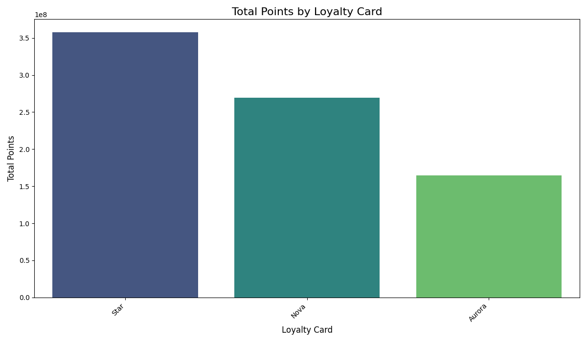
* **Insight Interpretation:**
    1.  Very Low Activity for the Majority: This graph shows that across all three card types (Aurora, Nova, Star), the vast majority of members (over 75%) have very few or near-zero accumulated points. This is evident from the very short "box" (boxplot) at the bottom of the plot.

    2.  Dominated by 'Super Users': All points earning activity is effectively driven by a handful of highly active members. These members are represented by data points outside the boxes (outliers) whose values far exceed regular members.

    3.  Card Tiers Show Highest Value: 'Super users' with the highest accumulated points are largely concentrated among Star and Nova cardholders. This indicates that your most valuable customers (in terms of points earned) are in these two card tiers.

* **Conclusion:**
    Your current loyalty program has a low level of engagement among the majority of members. The program functions more to reward a small group of elite customers who are already very active, rather than encouraging activity across the entire member base.

### 3. Relationship between Education and Number of Flights
* **Question:** Is there a relationship between a customer's education level and the average number of flights they take?
* **SQL Query:**
    ```sql
    SELECT
        Education,
        AVG(Total_Flights) as Avg_Total_Flights_Per_Record,
        SUM(Total_Flights) as Sum_Total_Flights
    FROM merged_view
    WHERE Education IS NOT NULL
    GROUP BY Education
    ORDER BY Avg_Total_Flights_Per_Record DESC
    ```
* **Graph:**
    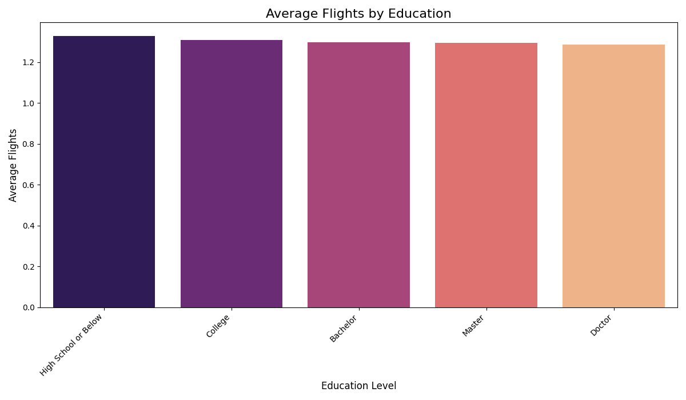
* **Insight Interpretation:**
    1.  No Significant Difference: This graph clearly shows that the average number of flights is almost the same across all education levels. All segments, from "High School or Below" to "Doctor", average around 1.2 flights.

    2.  Frequency vs. Distance: This finding is very interesting when compared to previous analyses. Although "Doctor" and "Master" customers fly more distance on each trip, they do not fly more often than customers with other education levels.

    3.  Uniform Behavior: In terms of frequency or number of flights, all your customer segments behave very uniformly.

* **Conclusion:**
    Education level is not a factor that can be used to differentiate how often a customer flies.
    The implication is that if you want to create a program to increase flight frequency (e.g., "fly X times get a bonus" promotion), targeting customers based on their education level will not be an effective strategy. All segments have the same potential to respond to such promotions.
    This reinforces the picture that postgraduate customers are long-haul flight specialists, while other customers fly just as often with a combination of short and long distances.

### 4. Flight Trends Over Time
* **Question:** What is the trend of the total number of flights monthly over time?
* **SQL Query:**
    ```sql
    SELECT
        Year,
        Month,
        SUM(Total_Flights) as Total_Flights_Per_Month
    FROM flight_activity_view
    GROUP BY Year, Month
    ORDER BY Year, Month
    ```
* **Graph:**
    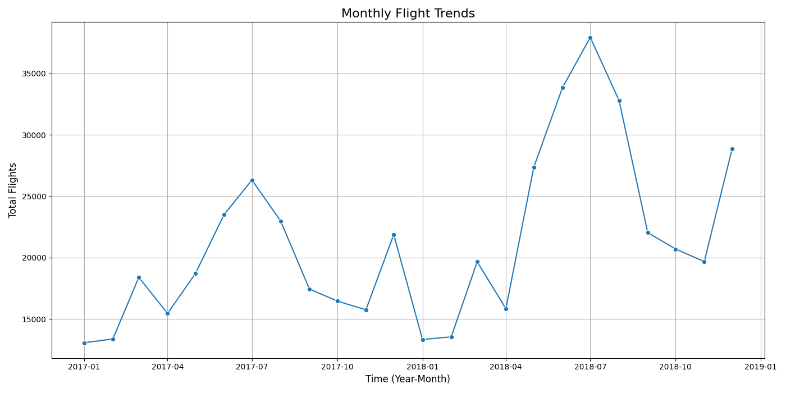
* **Insight Interpretation:**
    1.  Strong Seasonal Pattern: This graph clearly shows that the trend in the number of flights does not increase or decrease linearly, but rather follows a consistent and recurring seasonal pattern each year.

    2.  Peak Season (High Season): There are two main peak periods in a year:
        * Mid-Year Holiday Season (June - August): This is the busiest period for airlines, with the highest surge occurring in August.
        * Year-End Holiday Season (December): A second sharp surge occurs in December, clearly related to Christmas and New Year holidays.

    3.  Low Season: The number of flights reaches its lowest point in the period after the mid-year holidays, around September and October. February also shows a significant decrease each year.

* **Conclusion:**
    This airline business is highly seasonal. Customer demand is highly predictable, with peaks in the middle and end of the year, while the quietest period is in early autumn (September-October).

### 5. Relationship between Salary and Flight Distance
* **Question:** Is there a relationship between a customer's `Salary` level and the `Distance` they typically travel?
* **SQL Query:**
    ```sql
    SELECT
        Salary,
        Distance
    FROM merged_view
    WHERE Salary IS NOT NULL AND Distance > 0
    LIMIT 5000
    ```
* **Graph:**
    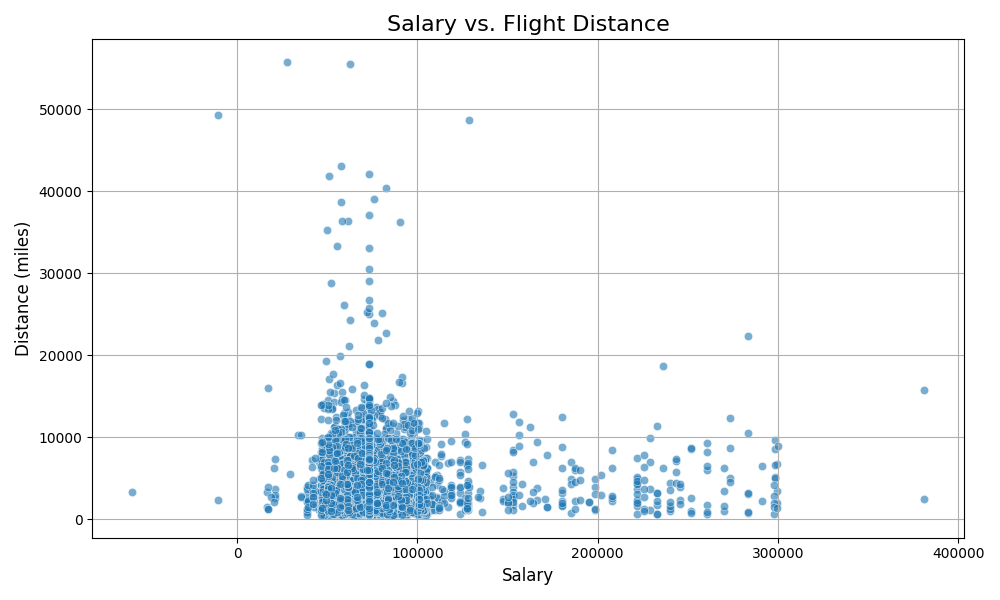
* **Insight Interpretation:**
    1.  Random Data Distribution: The data points on the graph are scattered randomly and do not form a clear pattern (such as a rising or falling straight line).

    2.  No Trend: This indicates that an increase in a customer's salary does not automatically mean they will travel further. Customers with low salaries may take long-distance flights, and conversely, customers with very high salaries may only take short-distance flights.

    3.  Salary Not a Predictor of Distance: A customer's salary level proves not to be a good predictor of how far they will fly on a trip.

* **Conclusion:**
    A customer's decision to take a long-haul or short-haul flight is not determined by their income level.
    This implies that other factors—not visible in this graph—are far more influential. These factors are likely:
        * Purpose of Travel: Whether for business, vacation, visiting family, or otherwise.
        * Lifestyle: Personal preferences of customers regarding vacation types.
        * Work Requirements: Certain types of jobs may demand long-distance travel regardless of salary.

    Strategically, using salary data to segment customers for long-haul flight promotions will not be effective. Better segmentation should be based on travel history or customer behavior itself.

### 6. Point Exchange Rate
* **Question:** What is the relationship between points redeemed (`Points_Redeemed`) and their monetary value in dollars (`Dollar_Cost_Points_Redeemed`)?
* **SQL Query:**
    ```sql
    SELECT
        Points_Redeemed,
        Dollar_Cost_Points_Redeemed
    FROM flight_activity_view
    WHERE Points_Redeemed > 0
    ```
* **Graph:**
    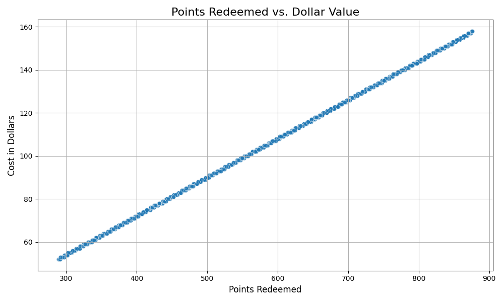
* **Insight Interpretation:**
    1.  Strong Positive Linear Relationship: The data points on the graph clearly form a straight line pattern sloping upwards from the bottom left to the top right. This shows a very strong positive linear relationship between Points_Redeemed and Dollar_Cost_Points_Redeemed. This means that as the number of points redeemed increases, their monetary value in dollars also increases proportionally.

    2.  Constant Exchange Rate: The straight line indicates that the dollar value obtained per point redeemed is constant across the observed data range. There is no indication of a change in exchange rate (e.g., becoming higher or lower) for specific amounts of point redemption.

    3.  Predictable: Because the relationship is linear and consistent, the dollar value that will be obtained for a certain number of points can be easily predicted. Similarly, the number of points needed to reach a certain dollar value can also be calculated.

* **Conclusion:**
    The exchange rate between points redeemed and their monetary value in dollars is fixed and uniform. The decision to redeem a certain number of points will result in a dollar value directly proportional to that number of points. This implies that this point redemption system operates with a very transparent and easy-to-understand exchange rate model, where each point has the same dollar "weight", regardless of the total number of points redeemed.

### 7. Salary Distribution by Education
* **Question:** How does the distribution of salary (`Salary`) compare among customers with different education levels (`Education`)?
* **SQL Query:**
    ```sql
    SELECT
        Education,
        Salary
    FROM merged_view
    WHERE Education IS NOT NULL AND Salary IS NOT NULL
    ```
* **Graph:**
    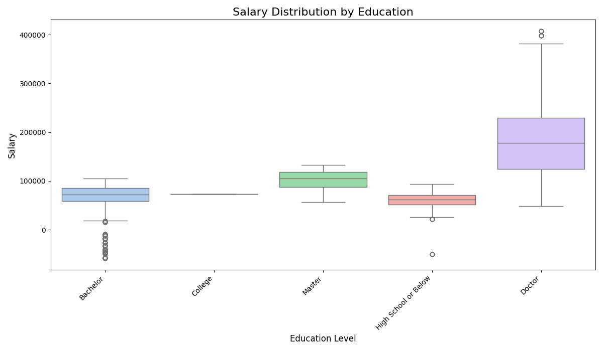
* **Insight Interpretation:**
    1.  Average Salary Increases with Education Level: Generally, there is a clear trend that the median salary (the middle line in the boxplot) tends to increase with higher education levels.
        * Doctor: Has the highest median salary and the widest salary range (from approximately $50,000 to over $380,000, with outliers reaching $400,000).
        * Master: Shows a higher median salary than Bachelor, College, and High School, with a range more concentrated around the median.
        * Bachelor: Has a significantly higher median salary than College and High School.
        * College: Has a relatively low median salary, but higher than High School or Below.
        * High School or Below: Shows the lowest median salary and the narrowest interquartile range (IQR), indicating a salary distribution more concentrated at lower values.

    2.  Salary Variability Differs Across Education Levels:
        * Doctor and Bachelor show the highest salary variability, indicated by the size of the box (IQR) and longer whisker ranges, as well as significant outliers. This means there is a greater difference in salaries among individuals within these education groups.
        * Master has a salary range quite concentrated around the median, showing lower variability compared to Doctor and Bachelor.
        * College and High School or Below show the lowest salary variability, with shorter boxes and whiskers, indicating that salaries tend to be more concentrated around the median for these groups.

    3.  Presence of Outliers at Several Education Levels:
        * Bachelor and Doctor have a number of outliers at the bottom and top, indicating that there are individuals with salaries significantly below or above most of their peers at the same education level. Outlier in the Doctor group also includes very high salaries, approaching $400,000.
        * High School or Below also has some outliers at the bottom, indicating individuals with very low salaries.

* **Conclusion:**
    Based on the salary distribution analysis, it can be concluded that education level is an important factor influencing salary size. The higher the education level achieved (especially up to a Doctor's degree), the higher the potential median salary that can be obtained. In addition, higher education levels (such as Bachelor and Doctor) also tend to have greater salary variability, indicating a wider range of financial opportunities among individuals with these qualifications. Conversely, lower education levels (such as High School or Below) tend to result in lower salaries and a more homogeneous salary distribution. This underscores the importance of education in one's earning potential.

### 8. Overall Salary Distribution
* **Question:** What is the overall distribution of customer income (`Salary`) in this loyalty program?
* **SQL Query:**
    ```sql
    SELECT Salary
    FROM merged_view TABLESAMPLE (10 PERCENT)
    WHERE Salary IS NOT NULL
    ```
* **Result:** 10% sample of customer salary data, used to create a histogram.
* **Graph:**
    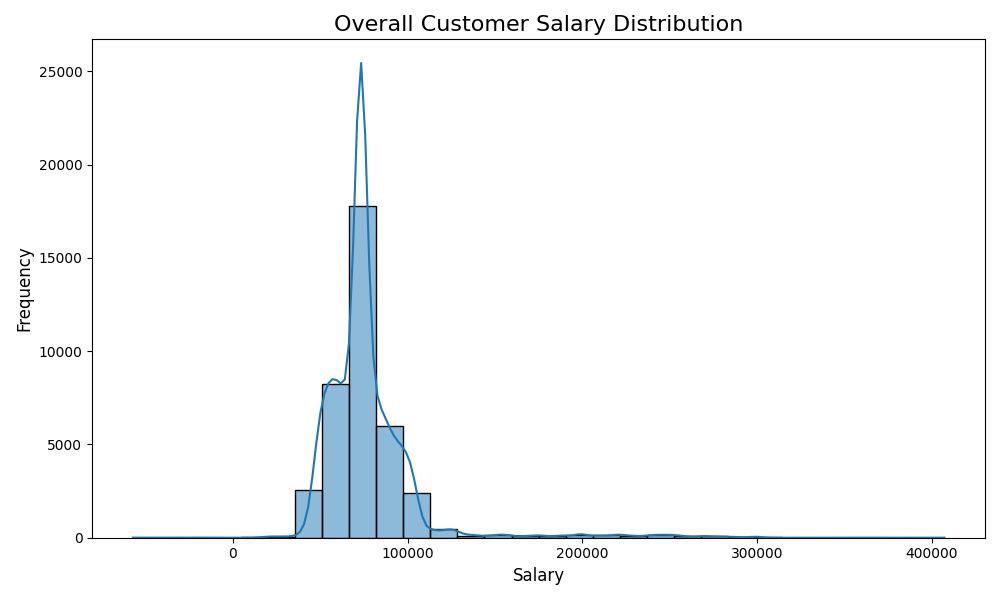
* **Insight Interpretation:**
    1.  Right-Skewed Distribution: The shape of the histogram shows that the salary distribution tends to be right-skewed (positively skewed). This means that most customers have salaries in the lower range, while there are a small number of customers with much higher salaries, creating a long "tail" on the right side of the distribution.

    2.  Mode (Peak) Around $75,000 - $80,000: The highest peak of the histogram (mode) is around $75,000 to $80,000. This indicates that most customers in this loyalty program have salaries in that range.

    3.  Majority Salary Concentration Below $100,000: The majority of frequencies (number of customers) are concentrated in the salary range below $100,000. After that point, the frequency of customers decreases sharply, although there are some customers with very high salaries.

    4.  Presence of Very High Salaries (Outlier): Although the frequency is low, the distribution shows customers with salaries reaching approximately $400,000. This indicates that this loyalty program successfully attracts a small segment of very high-income individuals.

    5.  Unimodal Shape: This distribution appears unimodal, meaning there is only one dominant peak. This indicates that most customers are clustered around a certain salary level.

* **Conclusion:**
    Overall, the income distribution of customers in this loyalty program is dominated by individuals with medium to lower-medium salaries, with a peak in the range of $75,000 - $80,000. Nevertheless, the program also successfully attracts a small segment of high-income customers. The implication is that loyalty program strategies may need to consider segmentation based on income levels, as the majority of customers are in a certain salary range, but there is also potential to target high-income segments with appropriate offers.

### 9. Demographic Composition
* **Question:** What is the composition of marital status (`Marital_Status`) within each education category (`Education`)?
* **SQL Query:**
    ```sql
    SELECT
        Education,
        Marital_Status,
        COUNT(*) as Customer_Count_Per_Segment
    FROM merged_view
    WHERE Education IS NOT NULL AND Marital_Status IS NOT NULL
    GROUP BY Education, Marital_Status
    ORDER BY Education, Marital_Status
    ```
* **Graph:**
    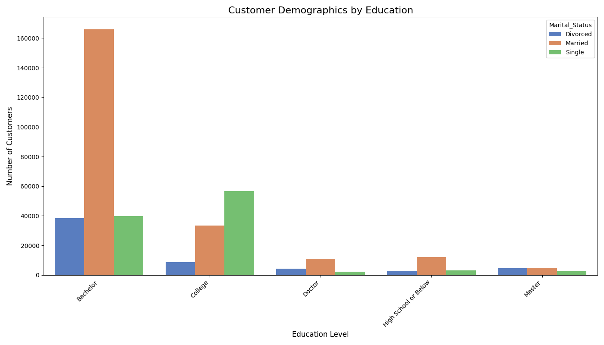
* **Insight Interpretation:**
    1.  Bachelor:
        * The Bachelor education category has the largest number of customers overall.
        * Among Bachelor-educated customers, Married is the most dominant marital status with a very significant number (over 160,000 customers).
        * Single is in second place, followed by Divorced with a lower number.

    2.  College:
        * The College category is the second largest after Bachelor.
        * Here, Single is the most dominant marital status (around 55,000 customers), far exceeding Married (around 30,000 customers) and Divorced.

    3.  Doctor, High School or Below, and Master:
        * These three education categories have significantly fewer customers compared to Bachelor and College.
        * For Doctor, Married seems slightly more numerous than Single and Divorced, although the numbers are small.
        * For High School or Below, Married is also dominant compared to Single and Divorced.
        * For Master, Married and Single have very similar and relatively small numbers, with Divorced being the least.

    4.  Comparison Between Education Categories:
        * An interesting pattern emerges: While Married dominates in Bachelor, Doctor, and High School or Below education levels, Single dominates at the College level.
        * The number of customers with Divorced status is relatively consistent and much lower across all education levels compared to Married and Single.

* **Conclusion:**
    Based on the graph analysis, it can be concluded that the composition of marital status varies greatly across different education levels. "Married" status is most common among customers with Bachelor, Doctor, and High School or Below education. However, for customers with College education, "Single" status is far more dominant. The number of divorced customers is consistently a minority group at all education levels.

### 10. Regional Activity
* **Question:** Which province recorded the highest total number of flights?
* **SQL Query:**
    ```sql
    SELECT
        Province,
        SUM(Total_Flights) as Total_Flights_Per_Province
    FROM merged_view
    WHERE Province IS NOT NULL
    GROUP BY Province
    ORDER BY Total_Flights_Per_Province DESC
    ```
* **Graph:**
    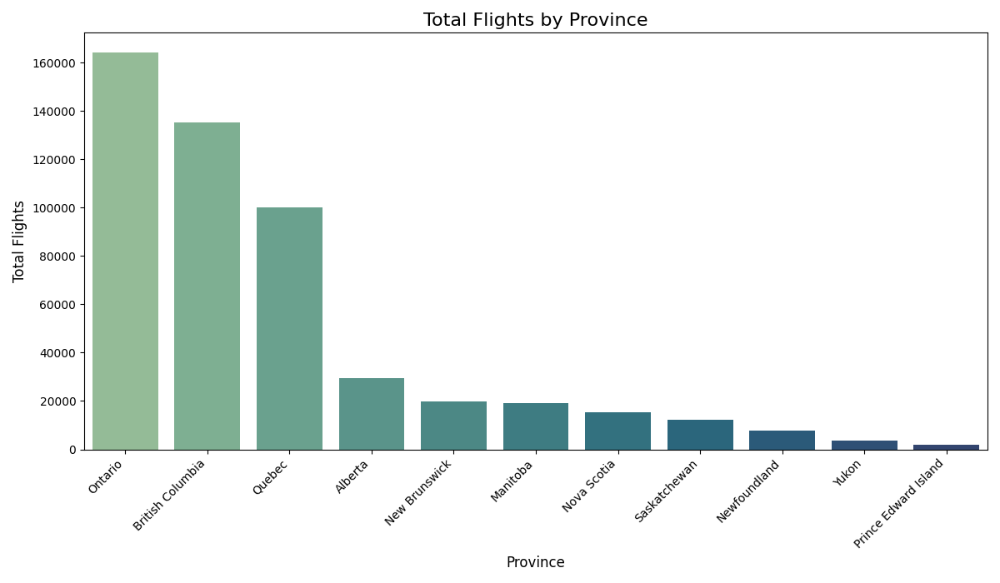
* **Insight Interpretation:**
    1.  Concentration of Flights in Several Key Provinces: This graph clearly shows that most flight activity is concentrated in a few provinces. Ontario is at the top with a very dominant number of flights (over 160,000), followed by British Columbia (around 135,000) and Quebec (around 100,000). These three provinces account for the largest portion of total flights.

    2.  Significant Decline After the Top Three: There is a drastic drop in the number of flights after the top three provinces. Provinces such as Alberta (around 28,000) and so on have significantly fewer flights compared to Ontario, British Columbia, and Quebec.

    3.  Low Flight Activity in Other Provinces: Provinces such as New Brunswick, Manitoba, Nova Scotia, Saskatchewan, Newfoundland, Yukon, and Prince Edward Island recorded very low numbers of flights, with Prince Edward Island having the lowest number.

* **Conclusion:**
    In conclusion, flight activity in the surveyed region is highly geographically concentrated. Ontario province is the main flight activity center, followed by British Columbia and Quebec. The majority of other provinces have significantly fewer flights, indicating that air mobility is largely dominated by a few large regional centers. This implies that if there are strategies related to flight frequency or air travel needs, the main focus should be on these high-volume provinces.

### 11. Point Redemption Value per Region
* **Question:** What is the total dollar value of points redeemed for each province?
* **SQL Query:**
    ```sql
    SELECT
        Province,
        SUM(Dollar_Cost_Points_Redeemed) as Total_Redemption_Value
    FROM merged_view
    WHERE Province IS NOT NULL AND Dollar_Cost_Points_Redeemed > 0
    GROUP BY Province
    ORDER BY Total_Redemption_Value DESC
    ```
* **Graph:**
    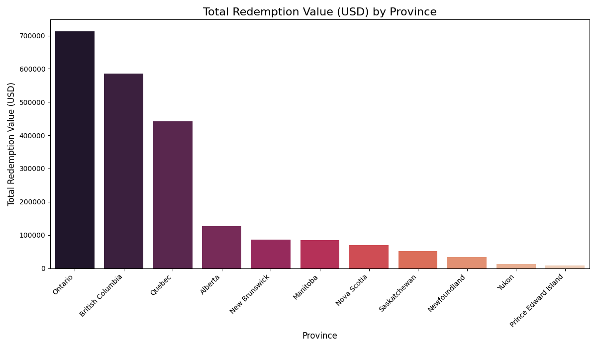
* **Insight Interpretation:**
    1.  Redemption Value Concentrated in Three Main Provinces: Similar to flight activity, the point redemption value (Total Redemption Value) is also highly concentrated in three major provinces: Ontario (around $710,000), British Columbia (around $580,000), and Quebec (around $440,000). These three provinces account for the majority of the total redemption value.

    2.  Drastic Decline After the Top Three: After Quebec, there is a very significant decrease in point redemption value. Other provinces such as Alberta (around $120,000) and so on have much lower redemption values.

    3.  Low Point Redemption Activity in Smaller Provinces: Provinces like Newfoundland, Yukon, and Prince Edward Island show the lowest point redemption values, which is consistent with the low number of flights in those areas.

    4.  Positive Correlation between Flights and Point Redemption: There is a clear correlation between provinces with high flight numbers and provinces with high point redemption values. This indicates that customers in more active flight regions tend to also be more active in redeeming their points.

* **Conclusion:**
    In conclusion, the point redemption value of this loyalty program is largely dominated by customers in Ontario, British Columbia, and Quebec provinces. This pattern is very similar to the distribution of total flights, indicating that provinces with high air travel activity are also the largest contributors to point redemption. This implies that this loyalty program is most effective and attractive to customers in large population and economic centers.

### 12. Financial Demographics
* **Question:** What is the average salary of customers based on marital status?
* **SQL Query:**
    ```sql
    SELECT
        Marital_Status,
        AVG(Salary) as Average_Salary
    FROM merged_view
    WHERE Marital_Status IS NOT NULL AND Salary IS NOT NULL
    GROUP BY Marital_Status
    ORDER BY Average_Salary DESC
    ```
* **Graph:**
    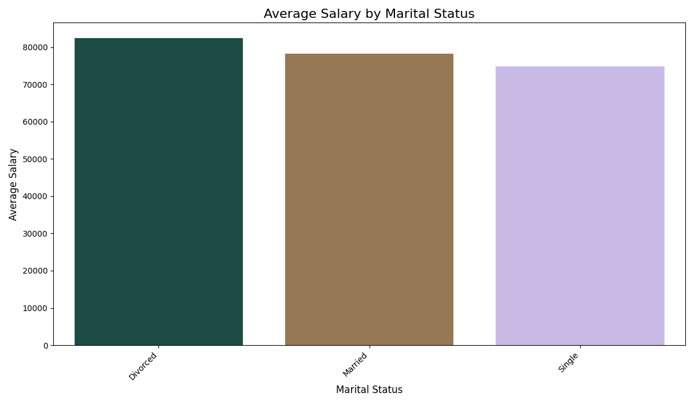
* **Insight Interpretation:**
    1.  Divorced Customers Have the Highest Average Salary: The graph shows that customers with Divorced marital status have the highest average salary, around $82,000.

    2.  Relatively Small Average Salary Differences: Although there are differences, the average salaries among the three marital status groups (Divorced, Married, Single) do not show very significant differences.
        * Married has an average salary slightly below Divorced, which is around $78,000.
        * Single has the lowest average salary among the three, which is around $75,000.
    3.  Marital Status Not a Strong Predictor of Salary: The relatively small differences in average salaries between groups indicate that marital status, based on this data, is not a very strong determinant or predictor of an individual's salary in this loyalty program. Other factors (such as education, experience, type of work, etc.) likely have a greater influence on salary.

* **Conclusion:**
    There are slight differences in average salaries among customers based on their marital status, with divorced individuals having a slightly higher average salary. However, this difference is not substantial, indicating that marital status alone does not significantly determine income levels within this customer group. Therefore, if marketing or customer segmentation strategies are to be based on income, relying solely on marital status might not be effective.

### 13. Customer Composition by Gender
* **Question:** What is the proportion of customers based on gender (`Gender`)?
* **SQL Query:**
    ```sql
    SELECT
        Gender,
        COUNT(DISTINCT Loyalty_Number) as Number_of_Customers
    FROM merged_view
    WHERE Gender IS NOT NULL
    GROUP BY Gender
    ```
* **Graph:** <br>
    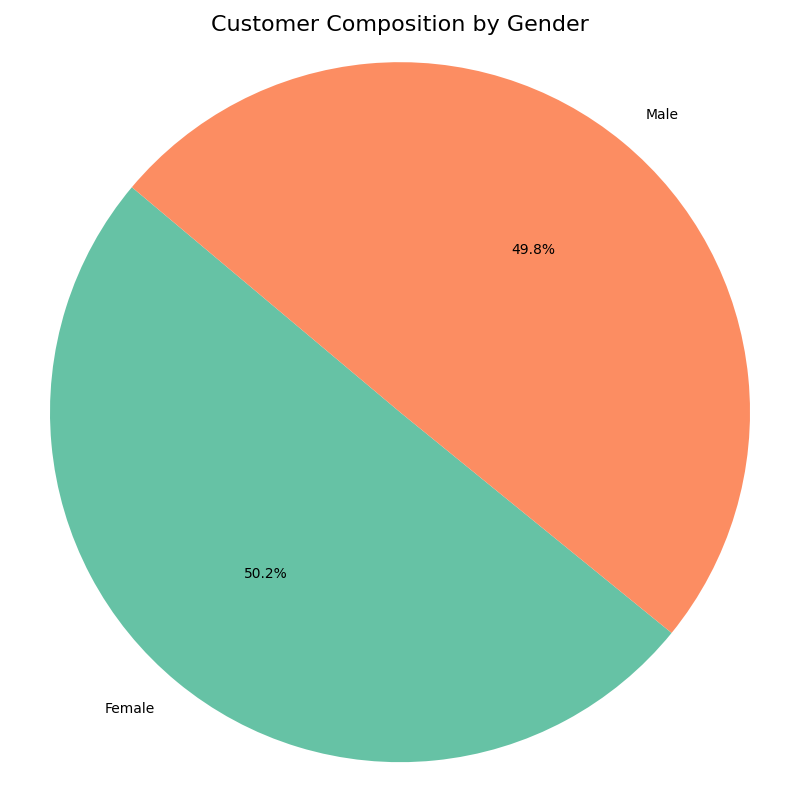
* **Insight Interpretation:**
    1.  Nearly Balanced Distribution: The pie chart clearly shows that the proportion of customers by gender is very close to balanced. Male customers are slightly under half of the total (49.8%), while female customers are slightly over half (50.2%).

    2.  Slight Female Dominance: Although the difference is very slight, female customers have a slight dominance in the customer composition compared to male customers.

* **Conclusion:**
    The gender composition of this loyalty program's customers is very balanced, with the number of female customers slightly exceeding male customers. This minimal difference indicates that the loyalty program appeals to both genders equally, without any significant bias towards a particular gender. This means that general (non-gender-specific) marketing and product strategies will likely be effective for the majority of the customer base.

### 14. Loyalty Tier Engagement
* **Question:** Which loyalty card type (`Loyalty_Card`) has members who collectively travel the furthest total distance (`Distance`)?
* **SQL Query:**
    ```sql
    SELECT
        Loyalty_Card,
        SUM(Distance) as Total_Distance_Flown
    FROM merged_view
    WHERE Loyalty_Card IS NOT NULL
    GROUP BY Loyalty_Card
    ORDER BY Total_Distance_Flown DESC
    ```
* **Graph:**
    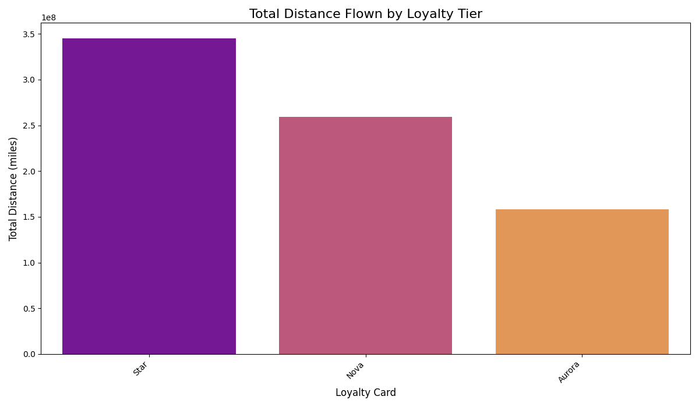
* **Insight Interpretation:**
    1.  "Star" Tier is the Most Active: Members with the Star loyalty card collectively traveled the furthest flight distance, around 350 million miles. This indicates that the "Star" customer segment travels most frequently and/or travels long distances.

    2.  "Nova" Tier in Second Place: The Nova tier is in second place with a significant total distance, around 260 million miles. This indicates that Nova members are also active travelers, although not as intensely as Star members.

    3.  "Aurora" Tier Travels the Least Distance: Members with the Aurora loyalty card traveled the least total flight distance, around 160 million miles. This indicates that the Aurora segment tends to be less active in taking flights or travels shorter distances compared to the other two tiers.

    4.  Clear Hierarchy in Flight Distance: There is a clear hierarchy in total flight distance among loyalty tiers, with Star at the top, followed by Nova, and then Aurora. This implies that these loyalty tiers are successful in identifying and grouping customers based on their travel activity levels.

* **Conclusion:**
    This loyalty program successfully identifies and incentivizes the most frequent travelers. Customers in the "Star" tier are the most valuable segment in terms of total flight distance, followed by "Nova", and then "Aurora". This shows that the loyalty tiering system effectively reflects and perhaps also encourages different levels of customer engagement in terms of travel frequency and distance. The program should focus on retaining and rewarding Star and Nova members, as they are the largest contributors to total flight distance.